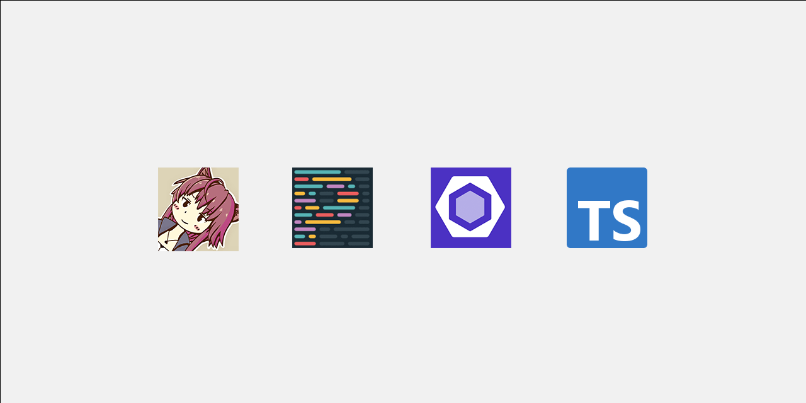

# ⚙️ lints-config

<!-- markdownlint-disable MD045 -->



<!-- markdownlint-enable MD045 -->

My configuration for the Biome / CSpell / Prettier and other tools

## Structure of the monorepo

- [`packages/biome-config`](packages/biome-config/README.md):
  My Biome configuration for general projects.
- [`packages/commitlint-config`](packages/commitlint-config/README.md):
  My commitlint configuration for general projects.
- [`packages/cspell-config`](packages/cspell-config/README.md):
  My CSpell configuration for general projects.
- [`packages/lint-staged-config`](packages/lint-staged-config/README.md):
  My lint-staged configuration for general projects.
- [`packages/markdownlint-config`](packages/markdownlint-config/README.md):
  My Markdownlint configuration for general projects.
- [`packages/prettier-config`](packages/prettier-config/README.md):
  My Prettier configuration for general projects.

### Moved packages

Build-related packages have been moved to a separate repository and
consolidated:
[`kurone-kito/builder-config`](https://github.com/kurone-kito/builder-config)

- `packages/typescript-config`: My TypeScript configuration for general
  projects.

## System Requirements

- Node.js: Any of the following versions
  - Iron LTS (`^20.11.x`)
  - Jod LTS (`^22.x.x`)
  - Latest (`>=24.x.x`)

## Development

Run `pnpm run build` before `pnpm run lint`.
Skipping the build step causes the lint command to fail.

```sh
pnpm run build
pnpm run lint
```

## Contributing

Welcome to contribute to this repository! For more details,
please refer to [CONTRIBUTING.md](.github/CONTRIBUTING.md).

Introduce commit message validation at commit time.
The “**[Conventional Commits](https://www.conventionalcommits.org/ja/)**”
rule is applied to discourage committing messages that violate conventions.

## LICENSE

[MIT](./LICENSE)
